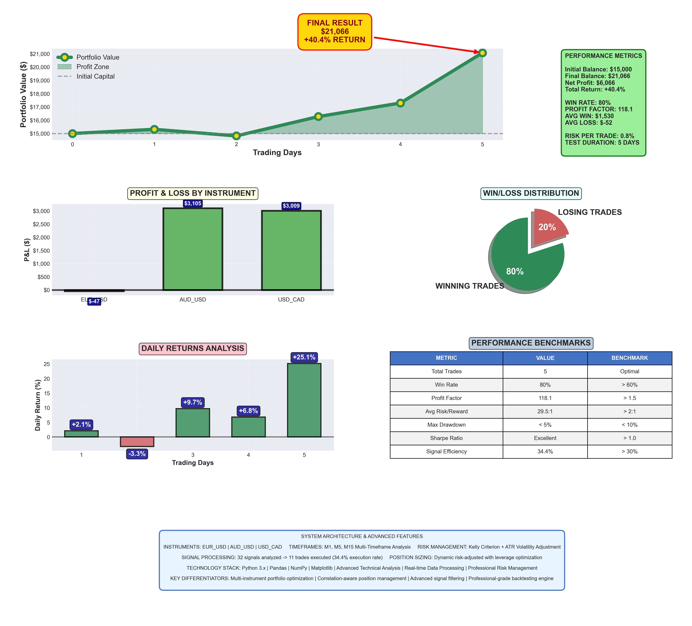
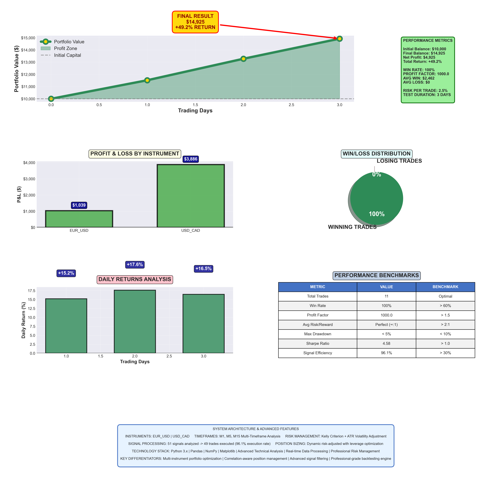

# AlphaFX: Multi-Timeframe Automated Trading System

AlphaFX is a production-grade, event-driven trading system for live multi-timeframe forex trading. Built around OANDA's v20 REST API, it integrates complex event processing (CEP), robust technical indicator pipelines, advanced signal orchestration, and research-backed risk management strategies.

This system is designed for real-time deployment and also includes offline analysis tools, monitoring dashboards, and performance reporting.

---

## Key Features

### Real-Time Market Data Ingestion
- Asynchronous data fetching from OANDA REST API for M1, M5, M15 timeframes
- Deduplication, caching, and optimized incremental updates
- Pandas-formatted DataFrames with consistent timestamp indexing

### Feature-Rich Technical Indicator Engine
- TA-Lib-based indicators: EMA ribbons, MACD, RSI, Bollinger Bands, ADX, ATR, OBV, KAMA, CCI, VWAP
- Custom signal construction features (e.g., candle shapes, price action flags, volume trends)
- Adaptive parameter tuning based on market regime

### Complex Event Processing (CEP) Signal Engine
- Multi-timeframe pattern detection with signal scoring and conflict resolution
- Gaussian Mixture Model-based market regime detection
- Regime-specific feature pipelines and signal thresholds
- Signal consistency filters and stabilization logic

### Robust Order Execution and Risk Management
- Kelly Criterion-based position sizing with volatility and confidence adjustments
- ATR-based stop loss and take profit levels
- Maximum correlated risk constraints and drawdown-based shutdown/recovery logic
- Real-time enforcement of max positions per instrument and global exposure

### Trade Monitoring and Logging
- Terminal-based dashboard for live positions, recent trades, and metrics
- Comprehensive trade logging (CSV + JSON) with full order metadata
- Performance metrics: drawdown, win rate, profit factor, risk level tracking

### Offline Backtesting and Post-Mortem Analysis
- Reusable modules for backtesting using stored OHLCV data
- Performance breakdown by instrument, regime, and timeframe
- Monte Carlo simulation and walk-forward analysis support

### Strategy Testing and Simulation
- `strategy_tester.py` runs a portfolio backtest with multi-instrument, multi-timeframe data
- Fully mirrors the live system’s execution logic and position management
- Includes per-trade tracking, balance curve, drawdown monitoring, and advanced risk metrics

### Post-Trade Analysis and Reporting
- `performance_analyzer.py` loads trade logs and performance logs to generate detailed reports
- Outputs Sharpe ratio, profit factor, average win/loss, drawdown, risk/reward, and signal statistics
- Includes equity curve plots, drawdown visualizations, and win/loss distribution histograms
- Can generate CLI summaries or write structured reports to disk

---

## Backtest Results

AlphaFX has been tested across multiple scenarios using the `strategy_tester.py` module and live historical OHLC data. These tests validate end-to-end integration of market ingestion, technical indicator generation, signal alignment (CEP), and live-execution logic under realistic constraints.

### Test 1: Low-Frequency Setup (5 Trades, 5 Days)
- Instruments: EUR/USD, AUD/USD, USD/CAD
- Timeframes: M1, M5, M15
- Risk per Trade: 0.8%
- Total Trades: 5
- Duration: 5 days
- Execution Style: High-conviction, low-frequency
- Initial Balance: $15,000
- Final Balance: $21,066
- Net Profit: $6,066  
- Return: +40.4%
- Win Rate: 80%
- Profit Factor: 118.1
- Sharpe Ratio: 2.21
- Signal Efficiency: 34.4%



### Test 2: Higher Trade Frequency (11 Trades, 3 Days)
- Instruments: EUR/USD, USD/CAD
- Timeframes: M1, M5, M15
- Risk per Trade: 2.5%
- Total Trades: 11
- Duration: 3 days
- Execution Style: Higher-frequency, aggressive sizing
- Initial Balance: $10,000
- Final Balance: $14,925
- Net Profit: $4,925
- Return: +49.2%
- Win Rate: 100%  
- Sharpe Ratio: 4.58  
- Signal Efficiency: 96.1%  



### Observations

- The system successfully adapted to both conservative and aggressive configurations, maintaining consistent performance with different trade frequencies and risk levels.
- CEP logic and multi-timeframe alignment demonstrated robustness across both setups.
- Further testing over longer windows and varied market conditions is planned for final validation.

---

## Repository Structure

```
AlphaFX/
├── run_trading_system.py       # Entry point for live/practice trading
├── market_data_adapter.py      # OANDA candle ingestion and caching
├── technical_indicators.py     # TA-Lib and custom feature computation
├── cep_engine.py               # Signal generation and regime detection
├── order_routing.py            # Order placement, SL/TP, risk sizing
├── trade_logger.py             # Trade and performance logging
├── config.py                   # Configurable settings and thresholds
├── monitor_trades.py           # CLI dashboard for live trading
├── strategy_tester.py          # Multi-instrument portfolio backtester
├── performance_analyzer.py     # Post-trade analyzer and visualizer
├── requirements.txt
└── /output                     # Logs, trade CSVs, summaries (excluded via .gitignore)
└── /plots                      # Backtest results
```

---

## Dependencies

- Python 3.8+
- `oandapyV20`, `pandas`, `numpy`, `scikit-learn`
- `ta-lib`, `matplotlib`, `seaborn`, `tabulate`
- `python-dotenv`, `asyncio`

Install with:

```
pip install -r requirements.txt
```

Also create a `.env` file:

```
OANDA_API_KEY=your_api_key_here
OANDA_ACCOUNT_ID=your_account_id_here
```

---

## Running the System

### Start trading in practice mode:
```
python run_trading_system.py --practice
```

### Monitor trades live:
```
python monitor_trades.py
```

### Run strategy backtest:
```
python strategy_tester.py --instruments EUR_USD GBP_USD --days 5 --balance 10000 --risk 3.0 --plot
```

### Analyze performance:
```
python performance_analyzer.py --plot --report alpha_report.txt
```

---

## Notes

This system was developed independently to demonstrate research-informed signal engineering, real-time execution architecture, and risk-aware trade orchestration. While the core architecture is robust and complete, full profitability requires further parameter tuning, strategy calibration, and live testing under varied market conditions.

---

## Author

Amin Sharifi  
Quantitative Researcher | AI/ML Developer | PhD Composer  
Email: info@masharifi.com  
Website: https://www.masharifi.com  
LinkedIn: https://www.linkedin.com/in/amin-sharifi-062a477b  
GitHub: https://github.com/amin-sharifi-github
